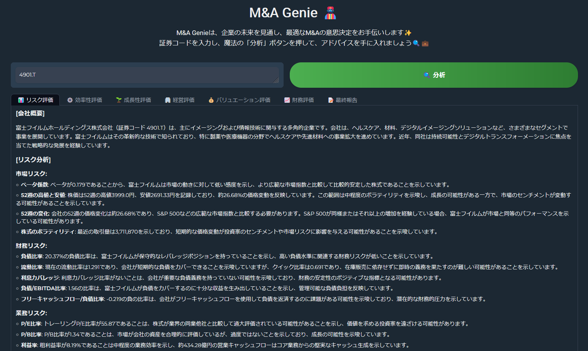

# Merge Genie 🧞‍♂️✨
## Project Overview 💼✨

Merge Genie is an intelligent agent designed to provide expert M&A (mergers and acquisitions) advice. By entering a specific stock code, the system utilizes a variety of powerful analytical tools and evaluation models to generate detailed M&A analysis reports. The data is fetched using the `yfinance` package, while six specialized evaluation agents cover key dimensions such as risk, efficiency, growth, management, valuation, and financial health, ensuring that users make well-informed M&A decisions. 💡📊

### Key Features 🔍🌟

- **Stock Code Analysis** 🔢: Users can input a stock code (e.g., 4901.T for Fujifilm), and the system will automatically gather and analyze relevant financial data.
- **Multi-dimensional Evaluation** 🛠️📈: Six independent evaluation agents generate comprehensive reports on risk, efficiency, growth, management, valuation, and financial health.
- **Report Generation** 📑🌐: The system automatically generates detailed reports in both English and Japanese, offering final, well-rounded insights for M&A decision-making.
- **User-friendly Interface** 💻🖱️: A Web UI built using Gradio allows users to easily input stock codes and interact with the system for immediate results.


#### 2024/9/15 Tool Formatting and Removal

Tool formatting has been removed for stability.


## Japanese Report Links

- [(Example) Fujifilm Final Report (Japanese)](./result/4901.T/Final/4901.T_final_report_japanese.md)
## Usage

1. Install the necessary libraries:
   
   ```
   pip install -r requirements.txt
   ```

2. Run`Merge_Genie.py` to start the Web UI::
   ```
   python Merge_Genie.py
   ```

3. Access the URL displayed in your browser.

4. Enter the stock code you want to analyze in the Web UI and click the "Analyze" button (e.g., for Fujifilm, enter 4901.T).

## Workflow
The following steps describe the workflow:

1. **Enter Stock Code**: The user enters the stock code they want to analyze.
2. **Agent Invocation**: Six agents use their respective tools to gather data and perform analysis.
- Risk Evaluation Agent
- Efficiency Evaluation Agent
- Growth Evaluation Agent
- Management Evaluation Agent
- Valuation Evaluation Agent
- Financial Evaluation Agent
3. **Report Generation**: Each agent generates reports in English and Japanese (Japanese reports are translated by LLMChain) and saves them in their respective folders.
4. **Final Report Creation**: Finally, a FINAL_REPORT is generated in the stock code/final folder, providing M&A advice to the user.

# Additional Features to Implement if Time Permits
**1. Utilizing RAG**: Synergy analysis during acquisition (analyzing together with the company's information database)  
**2. Implementing Calculation Tools**: Using the DCF method for company valuation  
**3. Graphing Analysis Results**  
**4. Using Financial LLM Models**  

## Agent Workflow

```mermaid
graph TD;
 A[Enter Stock Code] --> B[Risk Evaluation Agent]
 A --> C[Efficiency Evaluation Agent]
 A --> D[Growth Evaluation Agent]
 A --> E[Management Evaluation Agent]
 A --> F[Valuation Evaluation Agent]
 A --> G[Financial Evaluation Agent]
 B --> H[Save Risk English Report]
 B --> I[Save Risk Japanese Report]
 C --> J[Save Efficiency English Report]
 C --> K[Save Efficiency Japanese Report]
 D --> L[Save Growth English Report]
 D --> M[Save Growth Japanese Report]
 E --> N[Save Management English Report]
 E --> O[Save Management Japanese Report]
 F --> P[Save Valuation English Report]
 F --> Q[Save Valuation Japanese Report]
 G --> R[Save Financial English Report]
 G --> S[Save Financial Japanese Report]
 H --> T[Create Final English Report]
 J --> T
 L --> T
 N --> T
 P --> T
 R --> T
 T --> U[Translate Final English Report to Japanese]
 U --> V[Save Final Japanese Report]
